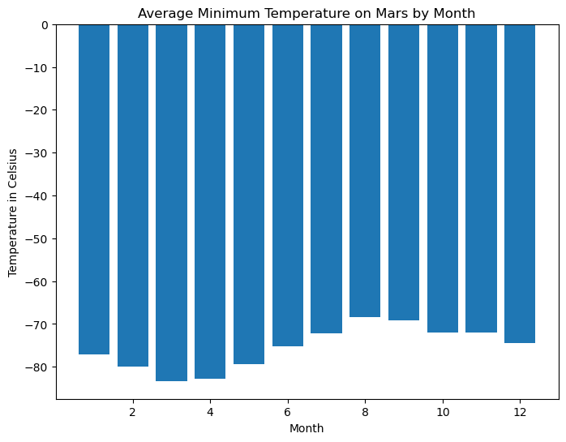
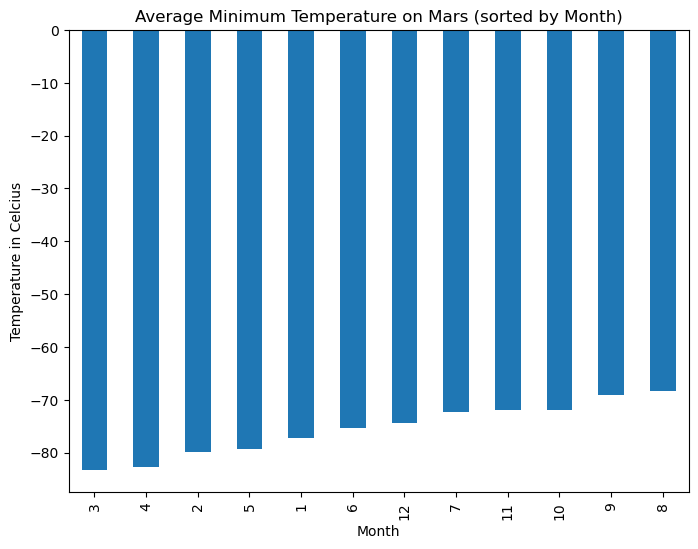
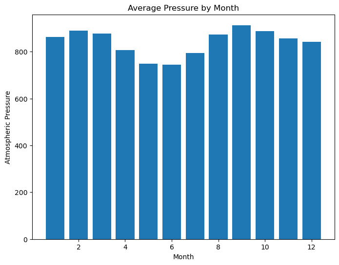
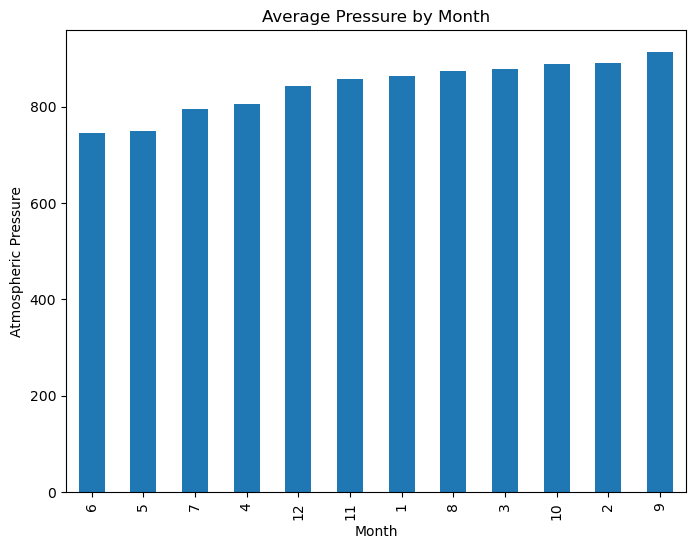
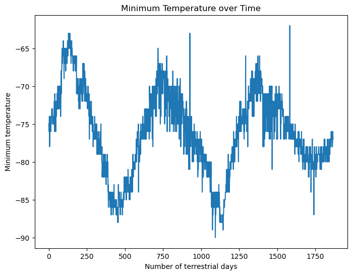

# Mars Data Analysis Project

## Overview

This project focuses on analyzing Mars weather data and news articles to extract meaningful insights. The analysis is performed using Python, with data sourced from publicly available datasets. The project is divided into two main parts:

1. **Mars News Scraping**: Extracting the latest news articles related to Mars.
2. **Mars Weather Analysis**: Analyzing temperature and atmospheric pressure data on Mars.

## Repository Structure

```
mars-data-analysis/
├── data/
│   └── mars_weather_data.csv
├── images/
│   ├── avg_min_temp_per_month.png
│   ├── avg_min_temp_per_month_sorted.png
│   ├── avg_pressure_per_month.png
│   ├── avg_pressure_per_month_sorted.png
│   └── min_temp_over_time.png
├── notebooks/
│   ├── mars_news_scraper.ipynb
│   └── mars_weather_analysis.ipynb
└── README.md
```

## Part 1: Mars News Scraping

**Notebook**: `mars_news_scraper.ipynb`

*Objective*: Scrape the latest news articles related to Mars.

*Process*:

- Utilize web scraping techniques to extract article titles and summaries from relevant websites.
- Store the extracted data for further analysis or reporting.

*Dependencies*:

- `requests`
- `BeautifulSoup`
- `pandas`

## Part 2: Mars Weather Analysis

**Notebook**: `mars_weather_analysis.ipynb`

*Objective*: Analyze Mars weather data to identify patterns and trends.

*Process*:

- Load and clean the Mars weather dataset (`mars_weather_data.csv`).
- Perform exploratory data analysis to understand temperature and atmospheric pressure trends.
- Generate visualizations to represent the data effectively.

*Key Visualizations*:

- **Average Minimum Temperature Per Month**: Displays the average minimum temperatures recorded each month.
  

- **Sorted Average Minimum Temperature**: Shows the average minimum temperatures per month, sorted in ascending order.
  

- **Average Atmospheric Pressure Per Month**: Illustrates the average atmospheric pressure recorded each month.
  

- **Sorted Atmospheric Pressure Trends**: Presents the average atmospheric pressure per month, sorted in ascending order.
  

- **Minimum Temperature Over Time**: Plots the minimum temperature variations over the recorded period.
  

*Dependencies*:

- `pandas`
- `matplotlib`
- `seaborn`

## Conclusion

This project provides insights into Mars's climatic conditions and recent news developments. By leveraging Python's data analysis and web scraping capabilities, we can better understand the Martian environment and stay updated on related news.